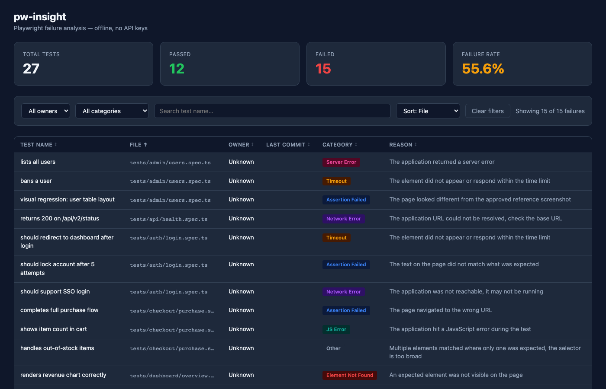

# pw-insight

Playwright test failure analyser — ownership, plain English reasons, filterable dashboard. No API keys. No internet. Fully local.



## What it does

- Parses Playwright's HTML report **or** `results.json` — both formats work
- Looks up the last git author for each test file (`git log --follow`)
- Translates raw error messages into plain English using pattern matching (no LLM)
- Categorises each failure (Timeout, Element Not Found, Assertion Failed, …)
- Generates a single self-contained HTML dashboard with filtering, sorting, and insights

## Install

```bash
git clone https://github.com/mandavillivijay/pw-insight.git
cd pw-insight
pip install .
```

Or directly from GitHub without cloning:

```bash
pip install git+https://github.com/mandavillivijay/pw-insight.git
```

With optional progress bars:

```bash
pip install ".[progress]"
# or
pip install "git+https://github.com/mandavillivijay/pw-insight.git#egg=pw-insight[progress]"
```

Requires Python 3.9+. No external runtime dependencies.

## Usage

### HTML report (default Playwright output)

```bash
pw-insight --report ./playwright-report --repo . --output ./pw-insight-report.html
```

Point `--report` at the `playwright-report/` folder (or its `index.html`). This is the directory Playwright creates when you run tests — no extra flags needed.

### JSON report

```bash
pw-insight --report ./playwright-report/results.json --repo . --output ./pw-insight-report.html
```

To generate `results.json`, run Playwright with `--reporter=json`:

```bash
npx playwright test --reporter=json > playwright-report/results.json
```

### Options

| Flag | Default | Description |
|------|---------|-------------|
| `--report` | *(required)* | Path to `playwright-report/` directory, `index.html`, or `results.json` |
| `--repo` | `.` | Git repository root for ownership lookup |
| `--output` | `./pw-insight-report.html` | Output HTML path |
| `--limit` | *(none)* | Cap the number of failures processed |

## Example terminal output

```
pw-insight v1.0.0
──────────────────────────────
→ Parsing playwright-report... 1,342 tests found
→ Extracting failures... 312 failed
→ Looking up git ownership... done (4 unique authors)
→ Explaining failures... done (local, instant)
→ Generating report...

✓ Report ready: ./pw-insight-report.html

Summary:
  Failed:  312    (23.2%)
  Passed:  1030   (76.8%)
  Authors: 4
  Top failure: Timeout (141 tests)
```

## Dashboard features

- **Summary bar** — total tests, passed, failed, failure rate
- **Filter bar** — by owner, by category, free-text search; live count
- **Failures table** — sortable by any column, hover for full file path, colour-coded category badges
- **Insights panels** — failures by owner, by category, top 10 most common reasons

## Failure categories

| Category | Triggered by |
|----------|-------------|
| Timeout | `timeout`, `timed out` |
| Element Not Found | `toBeVisible`, `not visible`, locator not found |
| Assertion Failed | `expect`, `toBe`, `toHave`, `toContain` |
| Network Error | `net::`, `ECONNREFUSED`, navigation timeout |
| Auth Error | 401, 403, unauthorized, forbidden |
| Server Error | 500, internal server error |
| JS Error | `TypeError`, `cannot read`, `undefined is not` |
| Visual Diff | screenshot, visual comparison |
| Other | everything else |

## Project structure

```
pw-insight/
  pw_insight/
    cli.py                entry point
    parser.py             Playwright JSON report walker
    html_report_parser.py Playwright HTML report (data/*.zip) parser
    git_blame.py          git log ownership lookup
    explainer.py          rule-based plain English explanations
    categoriser.py        failure category mapping
    reporter.py           self-contained HTML generator
  pyproject.toml
  README.md
```

## License

MIT
